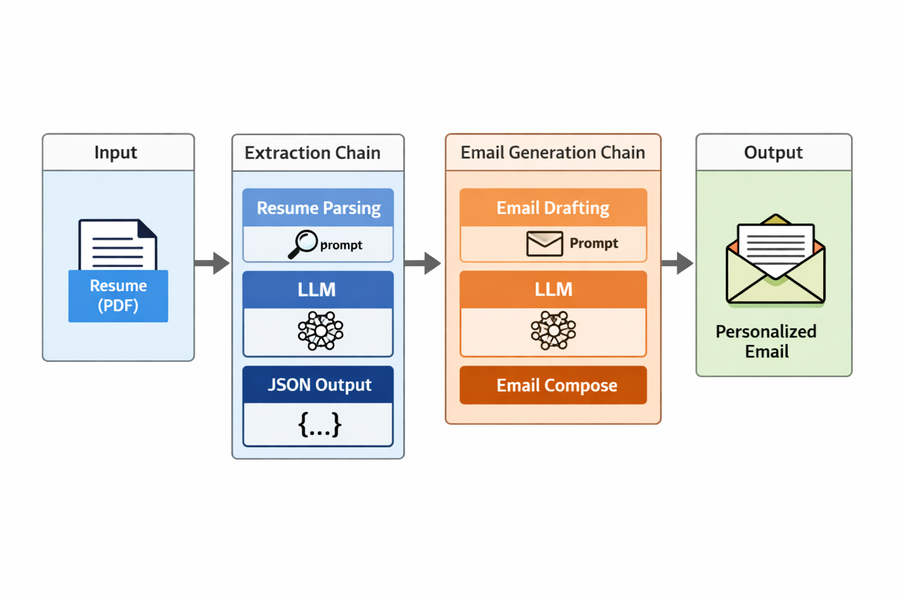

# 🚀 Resume2Mail

An AI-powered application that generates personalized cold emails for job applications using a candidate's resume and target job role.

---

## 🧠 Project Overview

This project allows users to:

* Upload their resume (PDF)
* Specify the company and role they are applying for
* Automatically generate a professional, tailored cold email to recruiters

The system extracts structured information from the resume and uses it to craft highly relevant and concise emails.

---

## 🌐 Live Application (Streamlit)

A Streamlit-based web interface allows users to:

Upload resume files
Enter job role and company name
Generate emails instantly

## ⚙️ How It Works
Resume Upload
User uploads a PDF resume via the web interface
Information Extraction
Resume content is processed and structured into JSON (skills, experience, education, etc.)
Email Generation
Based on extracted data + user input (role & company), a personalized email is generated

## 🛠️ Tech Stack
Python
LangChain
Groq (LLaMA models)
Streamlit (Web UI)

---

## 🚧 Current Status
   ✅ Core LLM pipeline implemented
   ✅ Streamlit UI for user interaction
   🔄 Improving extraction accuracy and prompt design

## 🔮 Future Improvements
   Resume-job match scoring
   Multiple email variations
   Better JSON validation
   Deployment (public web app)
   📌 Usage (Streamlit App)

---

## Run the app:

streamlit run main.py
Upload your resume (PDF)
Enter:
Target role
Company name
Click Submit
Get your generated email instantly

---

<h2>🏗️ Architecture</h2>

  

---

## 🤝 Contributing

This is a learning and experimental project — improvements and ideas are welcome!

---

## ⭐ Acknowledgement

Built as part of learning LangChain and real-world AI application development.
