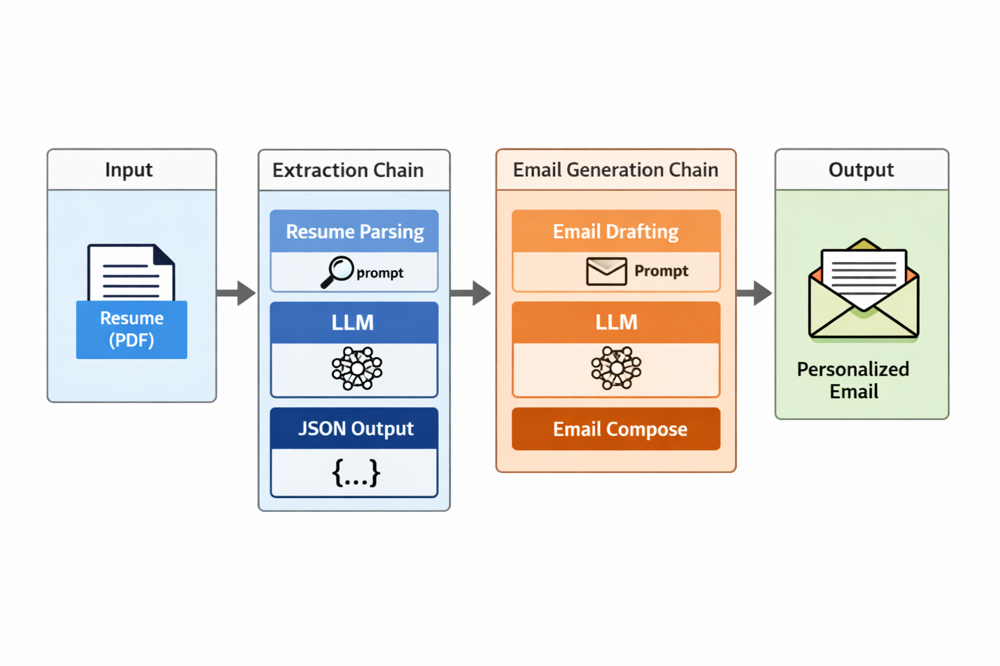

# 🚀 Resume2Mail

An AI-powered application that generates personalized cold emails for job applications using a candidate's resume and target job role.

---

## 🧠 Project Overview

This project allows users to:

* Upload their resume (PDF)
* Specify the company and role they are applying for
* Automatically generate a professional, tailored cold email to recruiters

The system extracts structured information from the resume and uses it to craft highly relevant and concise emails.

---

## ⚙️ How It Works

1. **Resume Upload**

   * PDF resume is loaded and converted into text

2. **Information Extraction**

   * LLM extracts structured data (skills, education, experience, projects) into JSON format

3. **Email Generation**

   * Based on the extracted profile + user input (company & role), a personalized email is generated

---

## 🛠️ Tech Stack

* Python
* LangChain
* Groq / LLM (LLaMA models)
* Jupyter Notebook (current development)

---

<h2>🏗️ Architecture</h2>

  

## 🚧 Current Status

* ✅ Core pipeline implemented in Jupyter Notebook
* 🔄 Working on improving prompt quality and structured extraction
* 🚀 Planning to build a **Streamlit UI** for better user interaction

---

## 🔮 Future Improvements

* Streamlit-based web app (upload + generate UI)
* Better JSON parsing & validation
* Support for multiple resumes

---

## 📌 Usage (Notebook)

1. Upload your resume PDF
2. Provide company name and role
3. Run the notebook cells
4. Get a generated cold email

---

## 🤝 Contributing

This is a learning and experimental project — improvements and ideas are welcome!

---

## ⭐ Acknowledgement

Built as part of learning LangChain and real-world AI application development.

